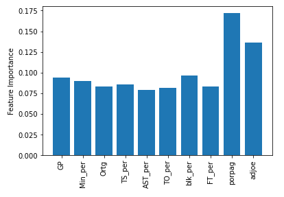

# Project 4: NBA Draft Predictions

## Contributors
- [Steven Broyles](https://github.com/Steven-Broyles)
- [Ryan "Fin" Finley](https://github.com/ryanfinley)
- [Cornelia Hinton](https://github.com/CORNELIAHINTON)
- [Theadora James](https://github.com/jamestheadora)
- [Jennifer Long](https://github.com/jennylynnlong)
- [Hazel Morris](https://github.com/Haze88)
- [Wesley Watkins](https://github.com/WWatkins142)

## Details About the Project
#### *What Questions Did We Want Answered?*
- Based on the college stats of past draft classes, what is the likelihood of 2022 college players getting drafted to the NBA?
- What variables are most important when predicting this?

#### *Our Datasets*
- [Basketball Datasets](https://www.kaggle.com/adityak2003/college-basketball-players-20092021)
  - [College Basketball Players 2009-2021](/Resources/CollegeBasketballPlayers2009-2021.csv)
    - 61,061 rows and 65 columns
  - [College Basketball Players 2022](/Resources/CollegeBasketballPlayers2022.csv)
    - 3,978 rows and 65 columns
  - [Drafted Players 2009-2021](/Resources/DraftedPlayers2009-2021.csv)
    - 781 rows and 7 columns

#### *Our Proposal*
- [Project 4 Proposal](Final_Project_Proposal.docx)

## Processing the Data and Building our Model
- Merged the [College Basketball Players 2009-2021](/Resources/CollegeBasketballPlayers2009-2021.csv) and the [Drafted Players 2009-2021](/Resources/DraftedPlayers2009-2021.csv) files and cleaned the data to create the [Cleaned College Basketball Players and Drafted Players file](/Resources/Updated_new_draft.csv).
- Cleaned the [College Basketball Players 2022 file](/Resources/CollegeBasketballPlayers2022.csv) to use as a [Potential Draft file](/Resources/Potential_Draft.csv).
- Built our model using the Random Forest Classifier
  - Feature Importances
    - 
      - Most Heavily Weighted Features
        - Points Over Replacement Per Adjusted Game
        - Adjusted Offensive Efficiency
  - Model Scores
    - 
  - Classification Report
    - 

## Visualizations and Website
- We used Tableau for our visuals and embedded them into our [NBA Draft Predictions Website](https://wwatkins142.github.io/project-4-team-pikachu/)

## Limitations
- NBA looks for specific draft positions
- G-league or International players dropped due to null values
- Less than 1% of dataset removed during merge due to wildcard characters
  - Example: Cam Thomas vs. Cameron Thomas
- Want to fit the model to columns that have different datatypes
- College Basketball Players csv datasets did not have guides to what each column meant

## Future Considerations
#### *What We'd Like to Add to the Project When We Have More Time*
- Section on the website to predict NBA draft probability based on stats inputted
- Dropdown menu for user to select player to view their draft probability and other stats
